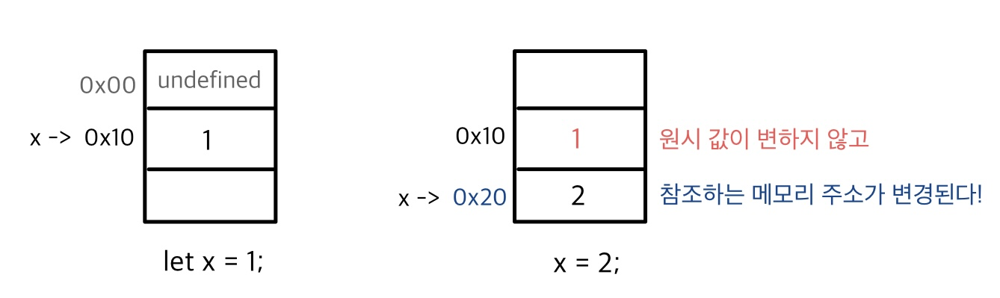
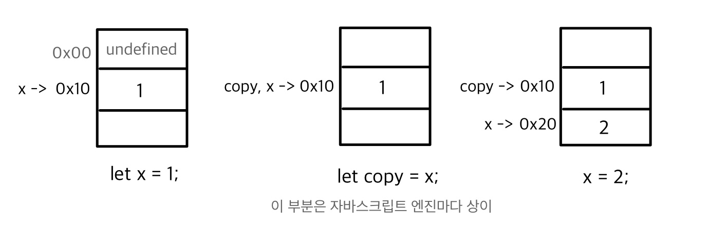
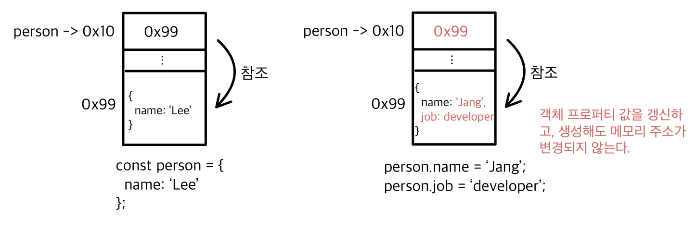
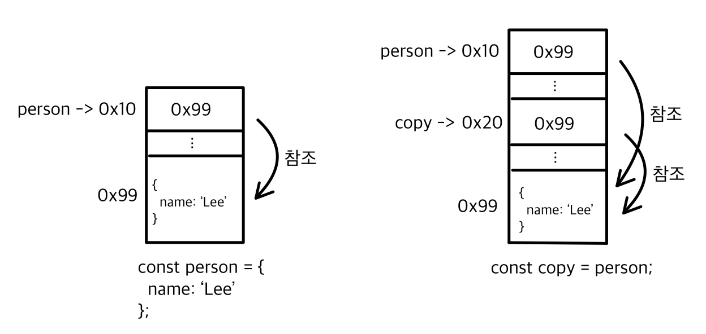

# 원시값과 객체의 비교

## 원시 타입 VS 객체 타입
|원시 타입(primitive type)|객체 타입(object/reference type)|
|------|------|
|변경 불가능한 값(immutable)|변경 가능한 값(mutable)|
|변수 할당 시 메모리에 실제 값이 저장|변수 할당 시 참조 값이 저장|
|원시 값 변수를 다른 변수에 할당하면 실제 값이 복사되어 전달(값에 의한 전달)|객체 값 변수를 다른 변수에 할당하면 참조 값이 복사되어 전달(참조에 의한 전달)|

### 변경 불가능한 값이란?
원시 타입의 값은 변경 불가능한 값이다.   
상수처럼 재할당이 불가능하다는 것이 아니고, 원시 값을 새로운 값으로 재할당하면 변수가 참조하던 메모리 주소가 변경되어 값이 변경되지 않는다는 것이다.



❓원시값의 불변성으로 데이터의 신뢰성을 보장하게 된다.   
만약 원시 값이 변경 가능하다면 예기치 않게 값이 변경되어 상태 변경 추적이 어렵게 된다.
-> 예기치 않게 값이 변경될 수 있는 상황은 무엇일까?   
아래 문자열처럼 일부 문자만 변경했을 때 변경되지 않는 것을 볼 수 있다.


문자열은 유사 배열 객체, 이터러블이기 때문에 배열처럼 각 문자에 접근이 가능하다.
> 유사 배열 객체는 인덱스로 프로퍼티 값에 접근할 수 있고, length 프로퍼티를 갖는 객체이다.

💡 원시 값인 문자열이 객체처럼 사용되면 래퍼 객체로 자동 변환이 된다. 이 후 ***래퍼객체*** 에서 알아보자.

```javascript
let str = 'hello world';
str[0] = 'H';
// str: hello world
```
문자열은 불변성을 가지므로 변경되지 않고 에러는 발생하지 않는다.   
문자열을 변경하려면 새로운 문자열로 재할당을 해야 한다.


### 값에 의한 전달이란?
변수에 원시 값을 담은 변수를 할당하게 되면 값이 복사되어 전달이 된다. 정확히 말하자면 메모리 주소를 전달해 그 메모리 주소에 저장된 값에 접근하여 저장된다.   
변수는 메모리 주소를 저장하는 식별자이기 때문이다.



원시 값 1을 저장한 x변수를 copy변수에 할당을 하면 그림처럼 같은 메모리 주소의 원시 값을 참조할 수도 있고, 별개의 메모리 주소의 원시 값을 참조할 수도 있다.   
중요한 건 두 변수 중 하나의 변수를 재할당해도 서로에 영향을 끼치지 않는다.

-----

### 변경 가능한 값이란?
객체 타입의 값은 변경 가능한 값이다.   
원시 타입의 값처럼 변수가 참조하는 메모리 주소에는 원시 값이 아닌 객체가 저장된 메모리 주소를 저장한다. 그리고 메모리에 저장된 객체를 수정할 수 있다.




자바스크립트 객체는 정적 언어처럼 프로퍼티가 정해져 있지 않고, 런타임에 동적으로 변경이 될 수 있다. 클래스 기반 객체지향 언어보다 객체의 생성과 프로퍼티 접근에 비용이 많이 든다.
=> chrome의 자바스크립트 엔진 V8에서는 이를 위해 ***히든 클래스***를 사용한다.

❓ 왜 객체는 변경 가능하게 했을까?   
원시 값처럼 값을 복사하면 명확하고 신뢰성있는 값이 되겠지만 객체는 크기가 매우 클 수도 있어 복사를 해서 생성하면 메모리 효율이 떨어진다. 그래서 효율을 위해 구조적 단점을 감안하여 설계가 되었다.   
하지만 이 구조적 단점으로 하나의 객체를 동시에 참조하는 부작용이 발생한다.

### 참조에 의한 전달
변수에 객체를 저장한 변수를 할당하게 되면 참조 값이 복사되어 전달된다.  
그래서 두 변수 중 어느 변수를 통해 객체를 변경해도 서로에 영향을 끼치게 된다.



참조에 의한 전달도 참조 값을 복사해서 저장하는 것이기 때문에 값에 의한 전달이라고 할 수 있다. 
사실 자바스크립트는 **값에 의한 전달**만 존재한다.  
해당 책에서는 원시 값, 참조 값을 구별하는 의미로 값에 의한 전달, 참조에 의한 전달이라고 언급하였다.