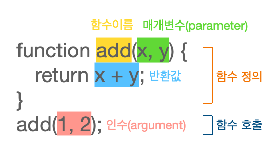

# 함수

## 함수란?
> 일련의 과정을 문으로 구현하고 코드 블록으로 감싸서 하나의 실행 단위로 정의한 것



## 왜 함수를 사용할까?
같은 코드가 반복될 때 함수로 정의하고 필요한 시점에 함수를 호출할 수 있기 때문에 코드의 **중복을 제거**하고, **재사용**할 수 있다.

## 함수 리터럴
> 자바스크립트에서 함수는 **객체** 타입의 값이다.

변수에 함수 리터럴를 할당할 수 있다. 리터럴은 값을 생성하는 표기법이다. 함수 리터럴도 값이므로 변수에 할당할 수 있다.
```javascript
var f = function add(x, y) {
  return x + y;
}
```

## 함수 정의
* 함수 선언문
* 함수 표현식
* Function 생성자 함수
* 화살표 함수(ES6)

### 함수 선언문

```javascript
function add(x, y) {
  return x + y;
}
```
||함수 선언문|함수 리터럴|
|------|------|------|
|형태|기명 함수 리터럴과 동일|함수 선언문과 동일|
|함수 이름|생략 불가능|생략 가능|
|문|표현식이 아닌 문|표현식인 문|

함수 선언문과 기명 함수 리터럴은 형태가 똑같지만 몇가지 특징은 다르기 때문에 **코드의 문맥**에 따라 함수 선언문인지 기명 함수 리터럴인지를 구분한다.   
단독으로 사용시 ➡️ `함수 선언문`   
변수에 할당하거나 피연산자로 사용시 ➡️ `함수 리터럴`

함수 선언문은 함수 이름으로 호출하는 것이 아니라 **자바스크립트 엔진이 암묵적으로 생성한 함수 이름과 같은 식별자로 호출**하는 것이다.   
자바스크립트 엔진이 암묵적으로 아래와 같이 함수 표현식처럼 변환한다고 생각할 수 있다(동일하게 동작하는 것은 아니다)
```javascript
var add = function add(x, y) {
  return x + y;
}
console.log(add(1,2)); // 식별자로 호출
```

### 함수 표현식
```javascript
var add = function (x, y) { // 익명 함수
  return x + y;
}
```

#### 함수 선언문 VS 함수 표현식

||함수 선언문|함수 표현식|
|------|------|------|
|호이스팅|함수 호이스팅|변수 호이스팅(var 변수에 할당시)|
|함수 선언 이전 함수 식별자|함수 호이스팅으로 런타임 이전에 이미 함수 객체가 생성이 됨|변수 호이스팅으로 런타임 이전 먼저 식별자를 생성하기는 하지만 undefined로 초기화됨|
|함수 선언 이전 함수 호출|호출 가능|TypeError. undefined를 함수처럼 호출하므로 에러|
||어디서든 호출 가능|함수 선언 후 호출해야 함|

함수 호이스팅은 함수 선언 후 함수 호출을 해야하는 규칙을 무시하므로 함수 선언문 대신 **함수 표현식 사용을 권장**한다.

### Function 생성자 함수
> 자바스크립트가 기본 제공하는 빌트인 함수 Function 생성자 함수

```javascript
var add = new Function('x', 'y', 'return x + y'); 
```

### 화살표 함수(ES6)
```javascript
var add = (x, y) => x + y;
```

## 함수 호출
> 함수를 호출할 때 매개변수 개수만큼 인수 개수를 전달하는 것이 일반적이긴 하지만 그렇지 않아도 에러가 발생하지 않는다.

매개변수에 전달된 인수가 없으면 undefined로 초기화 된다.
```javascript
function add(x, y) {// x = 1, y = undefined
  return x + y;
}
console.log(add(1));
```

매개변수보다 많은 인수가 전달되면 그 이상의 인수는 무시된다.   
모든 인수는 arguments 객체의 프로퍼티에 저장된다.
```javascript
function add(x, y) {// x = 1, y = 2
  console.log(arguments); // [Arguments] { '0': 1, '1': 2, '2': 3 }
  return x + y;
}
console.log(add(1, 2, 3));
```

## 함수 매개변수의 참조에 의한 전달
참조 타입형 변수를 함수 매개변수로 전달하고, 함수 내에서 변수를 조작하면 원본에 영향을 끼치게 된다.  
이렇게 되면 상태 변화를 추적하기 어려워지는 문제가 발생한다.   
이 문제의 해결 방법 중 하나는 객체를 **불변 객체**(Object.freeze)로 만들어 사용하는 것이다.   
객체의 상태 변경이 필요할 경우는 원본 객체를 깊은 복사를 해서 새로운 객체를 생성해 재할당한다.
```javascript
function deepCopyChange(obj) {
  obj = JSON.parse(JSON.stringify(obj)); // 깊은 복사로 새로운 객체로 재할당
  obj.a.thing = true;
}
const obj = {a: {thing: false}};
deepCopyChange(obj);
console.log(obj.a.thing);
```
📌 순수 함수: 외부상태를 변경, 의존하지 않는 함수

## 다양한 함수의 형태
* 즉시 실행 함수
* 재귀 함수
* 중첩 함수
* 콜백 함수
* 순수 함수, 비순수 함수

### 즉시 실행 함수(IIFE: Immediately Invoked Function Expression)
> 함수 정의와 동시에 즉시 호출되는 함수
```javascript
(function () {
  ...
}());
```

### 재귀 함수
> 자기 자신을 호출하는 함수
```javascript
function factorial(n) {
  if(n <= 1) return 1;
  return n * factorial(n - 1);
}
console.log(factorial(5));
```

### 중첩 함수(내부 함수)
> 함수 내부에 정의된 함수
```javascript
function outer() {
  ...
  function inner(){
    ...
  }
  inner();
}
outer();
```

### 콜백 함수, 고차 함수
> 콜백 함수: 함수의 매개변수로 전달되는 함수   
> 고차 함수: 매개변수로 콜백 함수를 전달받은 함수
```javascript
// 콜백 함수
var a = function(str){
  console.log(`${str}님 안녕하세요!`);
};

// 고차 함수
var b = function(f){
  f('홍길동'); //고차 함수에서 콜백 함수에 인자를 전달해 호출할 수 있음
};

b(a); // 콜백 함수 자체를 전달
```

#### 콜백함수 활용
* 함수형 프로그래밍 패러다임
* 비동기 처리(이벤트 처리, Ajax 통신, 타이머 함수 등)
* 배열 고차 함수(map, filter, reduce...)

### 순수 함수, 비순수 함수
> 순수 함수: 외부 상태에 의존하지 않고 변경하지 않는 함수   
> 비순수 함수: 외부 상태에 의존하거나 변경하는 함수

📌 외부 상태: 전역 변수, 서버 데이터, 파일, Console, DOM 등

#### 순수 함수의 특징
* 동일한 인수가 전달되면 언제나 동일한 값을 반환한다.
* 외부 상태에 의존하지 않고 매개변수를 통해 전달된 인수만 의존한다.
* 일반적으로 하나 이상의 인수를 전달받는다. 인수를 전달하지 않는 함수는 언제나 동일한 값을 반환하므로 상수와 같다.
* 인수를 변경하지 않는다.
* 외부 상태를 변경하지 않는다.

```javascript
var count = 0;

function increase(n) { // 순수 함수
  return ++n;
}

function decrease() { // 비순수 함수
  --count;
}

count = increase(count);
decrease();
```