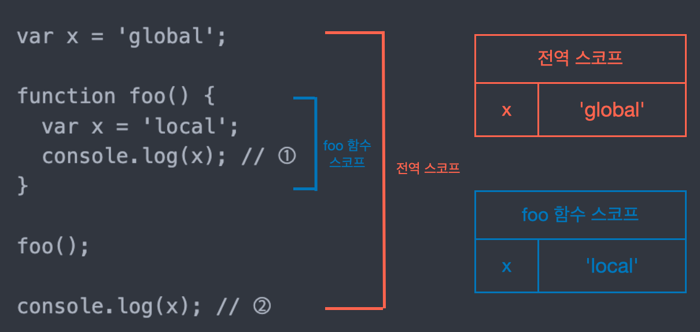
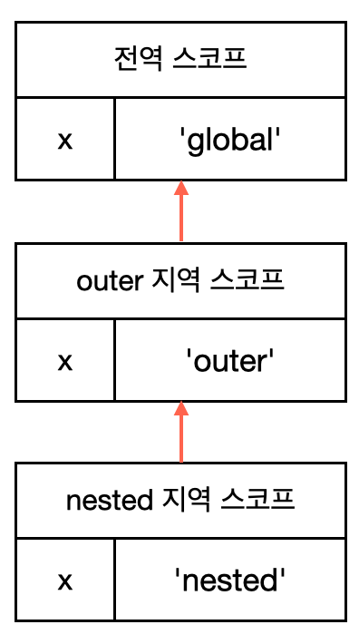

# 스코프

## 스코프란?
> 모든 식별자(변수, 함수, 클래스 이름)는 자신이 선언된 위치에 의해 다른 코드가 식별자 자신을 참조할 수 있는 유효 범위가 결정된다. 즉, 스코프는 식별자가 유효한 범위를 말한다.

자바스크립트 엔진은 스코프를 통해 어떤 변수를 참조할 지 결정한다. 이를 **식별자 결정**이라고 한다.   
코드를 실행할 때 코드의 문맥을 고려해 <u>코드가 어디서 실행되며 주변에 어떤 코드가 있는지</u>에 따라 다른 결과를 만든다.
```javascript
var x = 'global';

function foo() {
  var x = 'local';
  console.log(x); // ①
}

foo();

console.log(x); // ②
```

📌 렉시컬 환경(lexical environment)   
코드가 어디서 실행되며 주변에 어떤 코드가 있는지를 렉시컬 환경이라고 한다.  
즉, 코드의 문맥은 렉시컬 환경으로 이뤄진다.

전역 스코프와 foo 함수 스코프의 x변수는 식별자 이름은 동일하지만 스코프가 다르기 때문에 서로 다른 별개의 변수이다. 따라서 스코프 내에서 식별자는 유일해야 하지만 다른 스코프에서는 같은 식별자 이름을 사용할 수 있다.   



🚨 var 키워드는 같은 스코프 내에서 중복 선언이 허용되지만 권장되는 방식이 아니므로 사용하면 안된다.

## 스코프의 종류
* 전역(global): 코드 가장 바깥 영역
* 지역(local): 함수 몸체 내부

||전역|지역|
|------|------|------|
|스코프|전역 스코프|지역 스코프|
|변수|전역 변수|지역 변수|
|유효범위|어디서든 참조 가능|자신의 지역 스코프와 하위 지역 스코프에서 유효|

## 스코프 체인
> 스코프가 계층적으로 연결된 것

함수는 중첩될 수 있다. 즉, 스코프는 함수의 중첩으로 인해 계층적인 구조를 갖는다.
```javascript
// 전역 스코프
var x = 'global';

function outer() { // 외부 함수 ,지역 스코프
  var x = 'outer';
  
  function nested() { // 중첩 함수 ,지역 스코프
    var x = 'nested';
  }
}
```

변수를 참조할 때 자바스크립트 엔진은 스코프 체인을 통해 변수를 참조하는 코드의 스코프에서 시작하여 상위 스코프 방향으로 이동하며 선언된 **변수를 검색**한다.



위 이미지와 같이 자바스크립트 엔진은 코드 실행 전 렉시컬 환경을 실제로 생성해 식별자를 키로 등록하고 할당이 일어나면 값을 변경한다. 변수의 검색도 렉시컬 환경에서 일어난다.

### 스코프 체인 변수 검색
1. 변수를 검색할 때 자신의 지역 스코프에서 변수가 존재하는지 검색한다.
1-1. 존재한다면 해당 변수를 참조하고 검색을 종료한다.   
1-2. 존재하지 않다면 상위 스코프로 이동해 변수가 존재하는지 검색한다. 존재할 때 까지 반복한다.

## 블록 레벨 스코프 VS 함수 레벨 스코프
||블록 레벨 스코프|함수 레벨 스코프|
|------|------|------|
|유효범위|모든 코드 블럭|함수 코드 블럭|
|예|if, for, while, try/catch|function|
|해당 키워드|let, const|var|

자바스크립트의 var는 함수 레베 스코프만 인정하기 때문에 의도치 않은 값이 재할당되는 부작용이 발생한다.
```javascript
var x = 1;

if(x < 10) {
  var x = 100;
}

console.log(x); // 100
```
💡 15장. let,const키워드와 블록 레벨 스코프에서 블록 레벨 스코프에 대해 자세히 알아보자.

## 동적 스코프 VS 렉시컬 스코프(정적 스코프)
|동적 스코프|렉시컬 스코프|
|------|------|
|**함수를 어디서 호출**했는지에 따라 함수의 상위 스코프를 결정|**함수를 어디서 정의**했는지에 따라 함수의 상위 스코프를 결정|

자바스크립트는 **렉시컬 스코프**를 따른다. 즉, 함수를 정의할 때 상위 스코프가 결정된다. 호출된 위치는 영향을 주지 않는다.
```javascript
var x = 1;

function foo() {
  var x = 10;
  bar();
}

function bar() {
  console.log(x);
}

foo(); // 1
bar(); // 1
```
